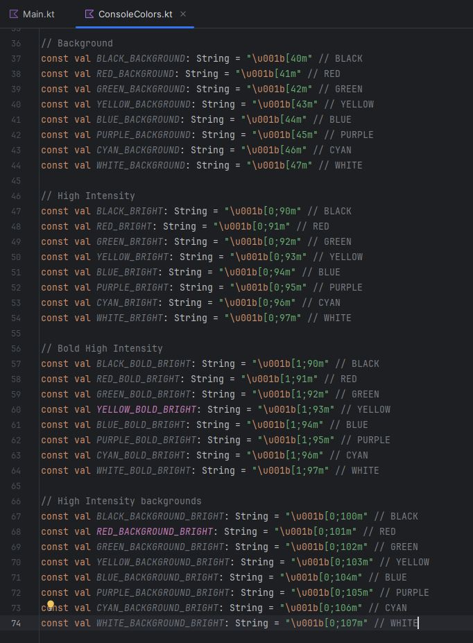

# Aplicació per fer un software d' una màquina de venda de bitllets: FGC i TMB.

Integrants: Miguel Ángel Garzón i Silvia Serra

L'aplicació tracta de desenvolupar el nou software de les màquines de venda de bitllets de tren dels FGC 
i de metro TMB on es podran comprar:

* 1: **Bitllet senzill**
* 2: **TCasual** 
* 3: **TUsual**
* 4: **TMes**
* 5: **TJove**

Un cop escollit el tipus de bitllet, es podrà escollir entre:

* **Zona 1**
* **Zona 2**
* **Zona 3**

Un cop fet es triarà:

* **Quantitat de bitllets**

Trobarem també l'opció de veure els preus actuals de cada tipus de bitllet i el preu segons les zones. 

Un cop escollides totes les opcions, el programa ens retornarà el preu final del bitllet escollit on seguidament
s'haurà de pagar el preu total i la màquina imprimirà el bitllet que retornarà el canvi corresponent.

Per últim es triarà entre si es vol imprimir ticket de compra o no.

#### Un operari pot aturar la màquina
> [!WARNING]  
> La màquina de venda de bitllets podrà ser aturada si un operari autoritzat introdueix el codi secret 4321.

## Generar documentació Dokka
> [!TIP]
>  Executa el comando gradlew dokkaHtml des del directori del projecte.
>  Recorda que has de tenir instal·lat el JDK en la teva màquina.

## Imatges de codi

- Funció de benvinguda al programa:

>

- Funció principal:

>

- Funció que permet escollir zones:

>

- Llibreria que fa servir colors:

>

- Mostra d'execució del programa:

>

- Mostra d'execució del programa, retorna canvi: 

>

### Enllaços

[Llibreria de Raimon Izard](https://github.com/raimonizard/kotlin)

[Crear ascii art](https://www.asciiart.eu/#google_vignette)

[Documentació GitHub](https://docs.github.com/es)

